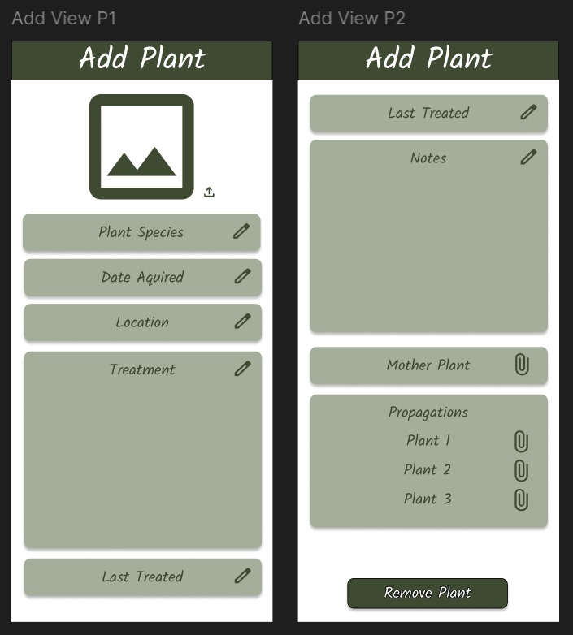
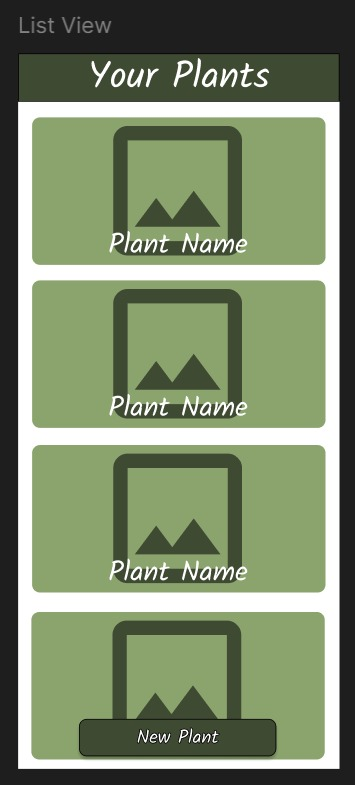

Plant Organiser

1. Short Description
This app is specifically designed for private plant collectors in need of a way to organise their plants. As a plant enthusiast, I want to be able to make a profile for each one of my plants. In this way, I can easily browse and manage them. I should also be able to link propagations to their mother plant.

Having this app will allow me to: - know what treatment each plant needs in terms of watering, fertilizing. - know when I last watered each plant. - know when I aquired each plant. - know the location of each plant. - know the propagations of each mother plant and the mother plant of each propagation. - know if a plant is in need of special treatment.

2. Domain details
Plant:
  Picture: A picture showcasing the plant.
  Type: The species of the plant including any possible variations.
  Date aquired: The date the plant has been bought or propagated.
  Location: The location of the plant
  Treatment: Represents a guide on: water type, soil type, fertilizer type (if applicable) and when to water.
  Last treated: The last time the plant has been watered.
  Notes: Notes on possible special treatments (eg: to combat bugs), if it needs repotting or other notes on this plant.
  Link to Mother Plant (if applicable): a link to the plant that this one has been propagated from (if the mother-plant also belongs to the user).
  List of Links to Propagations (if applicable): a link to the propagationg of the plant (if they belong to the user).
  
4. CRUD
Upon entering the app, the user is prezented with the option of visualizing all his plants or adding a new plant. When adding a new plant, the user can input all its properties or just the name and picture. When visualizing all the plants, they will be displayed such that the user can scroll through then and upon clicking one, be redirected to a page with the plant details. Along wiht the plant details, the user is offered the option to update the entire plant profile or remove the plant. When removing the plant

5. Persistence
Our app should be connected both to a database and a server. The changes caused by adding, deleting or updating a plant should persist on the server and on the local database.

When the user is online, the data for listing our entities is taken from the server (so updates are reflected immediately).

When the user is offline, the temporary data is taken from the local database.

6. What happens if the user is offline?
The changes persist locally in the database and are synced with the server once the user is back online.

When the application is used offline, all the operations performed store the information locally:
  - the entities created are stored in the local database
  - the read operation is performed on the locally saved entities
  - the update operation goes for the locally saved entities
  - the delete operation is performed on the local database

